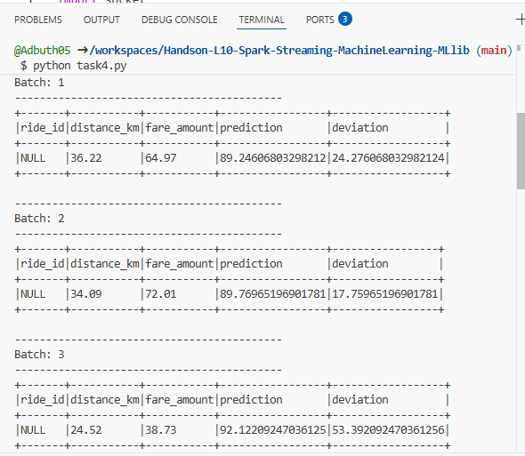

# Handson-L10-Spark-Streaming-MachineLearning-MLlib
---

## 📘 Overview
This project implements a **real-time analytics pipeline** for a ride-sharing platform using **Apache Spark Structured Streaming** and **MLlib**.  
The goal is to simulate live ride data, train machine learning models, and continuously predict fares and fare trends using Spark’s streaming capabilities.

---

## 🗂️ Repository Structure
```
HANDSON_L10/
│
├── data_generator.py
├── training-dataset.csv
├── task4.py                      # Real-Time Fare Prediction (Task 4)
├── task5.py                      # Time-Based Fare Trend Prediction (Task 5)
│
├── models/
│   ├── fare_model/
│   │   ├── data/
│   │   └── metadata/
│   └── fare_trend_model_v2/
│       ├── data/
│       └── metadata/
│
└── output_images/
    ├── task4_output.png
    ├── task5_trend_output.png
    └── model_training.png
```

---

## ⚙️ Environment Setup

1. **Open the Codespace**
   - Open the repository in GitHub Codespaces.

2. **Check versions**
   ```bash
   spark-submit --version
   python3 --version
   ```

3. **Install dependencies**
   ```bash
   pip install pyspark pandas numpy
   ```

4. **Start the data stream**
   ```bash
   python data_generator.py
   ```
   Keep this running in one terminal — it continuously sends ride data to the socket (`localhost:9999`).

---

## 🚕 Task 4 – Real-Time Fare Prediction

**Goal:** Predict ride fares in real time based on distance traveled.

### 🔧 Steps
1. Load training data (`training-dataset.csv`).
2. Assemble feature column (`distance_km` → `features`).
3. Train a Linear Regression model on fare prediction.
4. Save model to `models/fare_model/`.
5. Read live streaming data from socket.
6. Apply trained model → generate predictions.
7. Calculate deviation between actual and predicted fare.
8. Output results continuously in console.

### ▶️ Run Commands
```bash
# Terminal 1
python data_generator.py

# Terminal 2
python task4.py
```

### 🖼️ Output Screenshot


> Console output displays distance, actual fare, prediction, and deviation.

---

## ⏰ Task 5 – Time-Based Fare Trend Prediction

**Goal:** Predict average fare trends within 5-minute windows using cyclical time features.

### 🔧 Steps
1. Aggregate `training-dataset.csv` into 5-minute windows.
2. Compute `avg_fare` for each window.
3. Extract features: `hour_of_day`, `minute_of_hour`.
4. Train and save model to `models/fare_trend_model_v2/`.
5. Stream live rides and apply same aggregation.
6. Use trained model for real-time trend prediction.

### ▶️ Run Commands
```bash
# Terminal 1
python data_generator.py

# Terminal 2
python task5.py
```

### 🖼️ Output Screenshot


> Displays 5-minute time windows with actual and predicted average fares.

---

## 📊 Models
| Model | Description | Location |
|--------|--------------|-----------|
| **Fare Model** | Linear Regression on `distance_km` vs `fare_amount`. | `models/fare_model/` |
| **Fare Trend Model** | Linear Regression on `hour_of_day` and `minute_of_hour`. | `models/fare_trend_model_v2/` |

---

## 🧠 Observations
- **Distance** and **fare** show a near-linear relationship, confirming the suitability of Linear Regression.  
- **Time-window aggregation** helps reveal daily fare variations and periodic patterns.  
- Spark Structured Streaming efficiently handles continuous inference without manual refresh.

---

